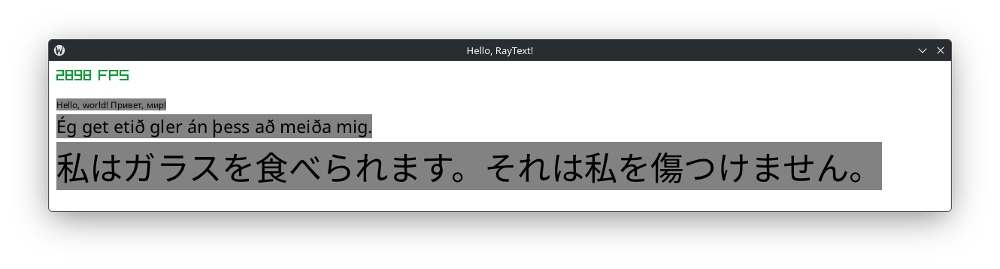

# raytext
Simple Dynamic Glyph Caching (DGC) font implementation for raylib.

(Almost) drop-in replacement of the standard text API of raylib.

## Gallery

## Quickstart
Copy `raytext.[ch]` and `stb_*.h` libraries to your project. If you don't define STB implementations anywhere then you can define when including the raytext header.

---

Fonts used are Noto Sans and Noto Sans Japanese.